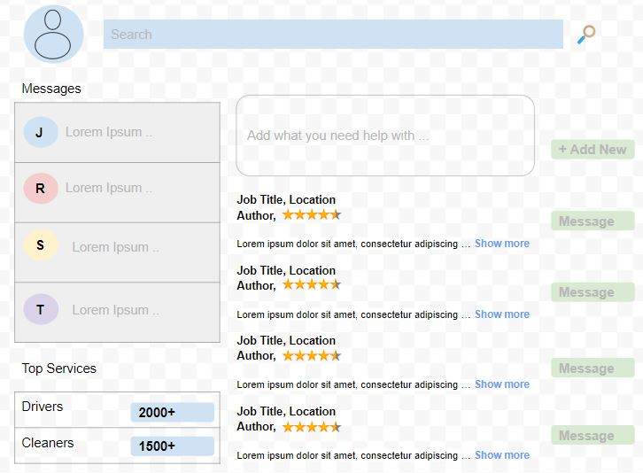
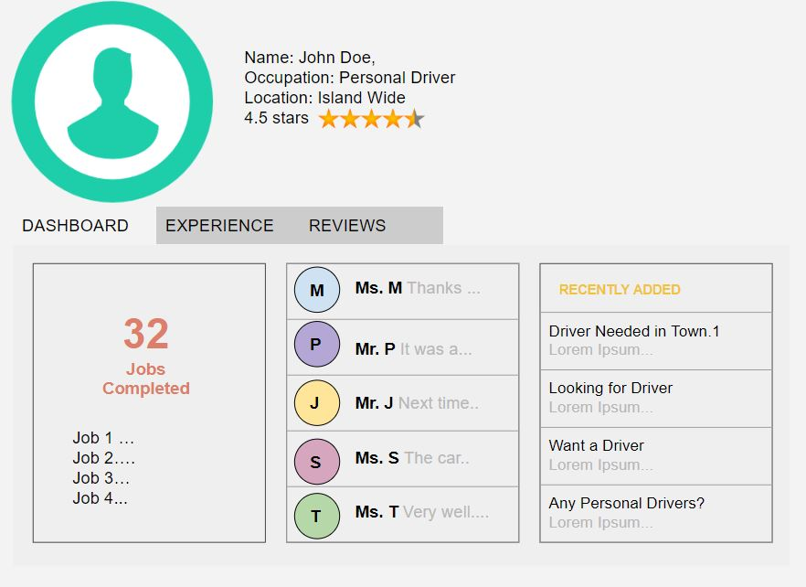
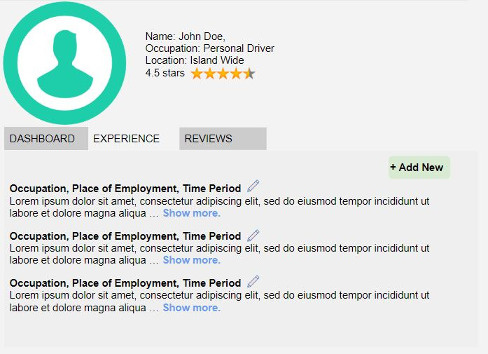
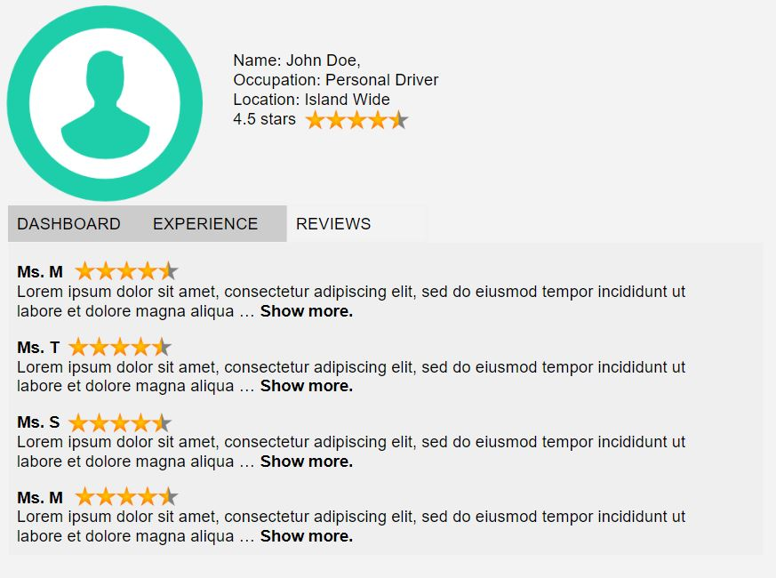
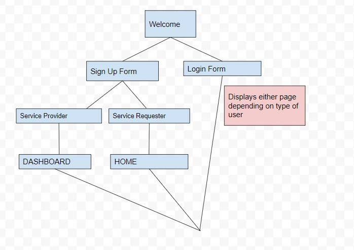

## Day's Work
# Overview
Tired of posting ads for services in ineffective places? Tired of responses from untrusted sources?  
So many people find it difficult when they need someone to perform a short term and relatively simple service. Of course there are some applications that provide specific services but if you are a person that leads a busy life, wouldn't you prefer to have one app instead of 5?  
Day's Work is here to simplify the tasks of getting the services you need by providing a platform where all your service ads directly engage with the people who want to do them. As a user, you can post about any service such as dog walking, picking up laundry, getting a driver for a day etc. and the first three responders will show up in your indbox. You can then view the profiles of those who responded, read about their experiences, see their references and read reviews left by others. If unsatisfied with the first three, the user can request to see more responses to the ads before making a decision. 

# Data Model
The application will store:
  * two users, the service providers(SP) and the serivce requesters(SR).
  * SP experiences and references
  * SP reviews
  * SP count of jobs completed
  * SR posts
  * //messages between SR and SP

Each SR can see the services that are most popular, make an ad post and message SPs. 
Each SP can view and respond to ad post, update their experiences and references and mesage SRs.

Example Models
User
``` 
{
  fName: Johhn
  LName: Doe,
  email: johndoes@somemail.com
  password: hash,
  phone: 1234567890
  
  //only for SPs
  experience: //reference to experience
  references: //reference to references
  reviews: //reference to revies
  
  //for SRs only
  posts: //reference to posts
} 
```
Experience (Same structure for references and reviews)
``` 
{
  user:"johndoe@somemail.com"
  experience: [
  {title: "Personal Driver", company:'Private Family, NYC" duration:"2016 - 2017", desc:"Lorem Ipsum" },
  {title: "Personal Driver", company:"Executive at Some Company, NYC" duration:"2013 - 2016", desc:"Lorem Ipsum" },
  {title: "Driver", company:"Taxi company, NYC" duration:"2011 - 2013", desc:"Lorem Ipsum" }
  ]
}
```
With references the inner object is
```
{ fName:"Jane", lName: "Doe", email: "janedoe@somemail.com", phone:1234567890 }
```

With reviews the inner object is
```
{ title:"Good Job", by: "someuser@somemail.com", rating: 4.5, desc:"Lorem Ipsum"}
```

Ad-Posts 
```
{
  user: "janedoe@somemail.com"
  desc: "Lorem Ipsum"
}

```
Link: [DB SCHEMA](src/db.js)

## Wireframes 
/user/ads - Ads Post
  
Shows all posts relevant to user by default, user can search for other posts.
SR can make posts as well.

/user/home - SP Summaary
  
Gives the summary of jobs completed, conversations being held and new sevice requests that were added.

  
Shows all experience added with the ability to add more

  
Shows all reviews given to the user.

##SiteMap

Here's a draft of the sitemap  
  

## User Stories
SR and SP  
As a user I can to sign up for the site  

**SR**   
As a user, I can to add my experience  
As a user, I can to update my experience  
As a user, I can to delete my past experience  
As a user, I can to see the reviews of me  
As a user, I can to see the number of jobs I completed  
As a user, I can to see the last 3 jobs I completed  
As a user, I can to see in-app messages between me and clients  
As a user, I can to see jobs that are related to my job  

**SP**  
As a user, I can to post about a service I need  
As a user, I can to specify the time-frame  
As a user, I can to propose a price range  
As a user, I can to see servicers who are available  

## Research Topics
* (5 points) Integrate user authentication
  * I'm going to be using passport for user authentication
  * I'll email you the password for the testing account after it's been made
  
* (1 point) Clinet side form validation  
  * For eg.. checks that all required fields are filled out or checks out of range value
* (3 points) Angularjs 
  * Frontend Framework
* (3 points) In-App messaging
  * Using Twilio's APIs
  
 ## [App.js](src/app.js)  
 
(___TODO__: list any tutorials/references/etc. that you've based your code off of_)

