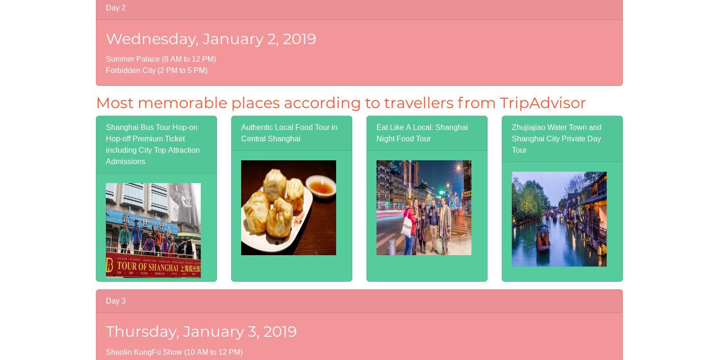
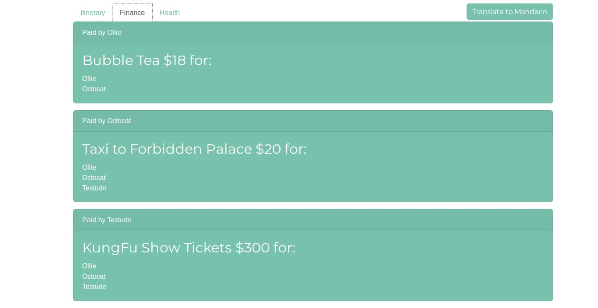
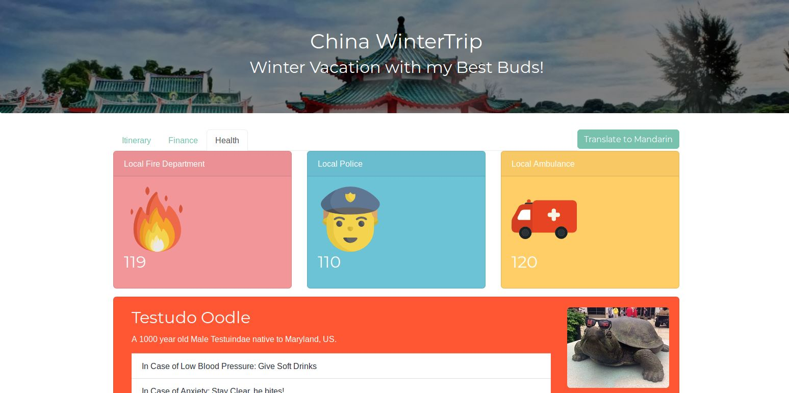
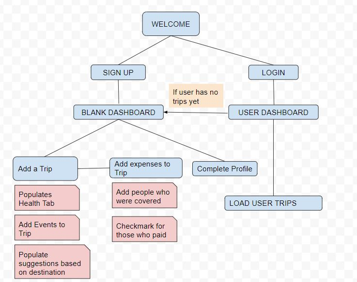

## Wanderlust 360
# Overview
Need an all-in-one space to plan your trips? Look no further, Wanderlust 360 will keep all your planning in one place from managing activities, keeping track of finances and storing important local info for international travels.

Wanderlust 360 is also great for managing group trips. It provides a clean interface to split bills so you can keep track of IOUs. 

# Data Model
The application will store:
  * user info
  * trips
  * transactions
  * countries
  * health info

Example Models
User
``` 
{
  fName: Johhn
  LName: Doe,
  email: johndoes@somemail.com
  password: hash,
  phone: 1234567890,
  trips: [
   {title: "Ski Trip", startDate: 2018-12-25, endDate: 2019-01-05, dest: "French Alps, France"}
  ],
  healthInfo: [
   {name: "Peanut Allegery", pres: "None", instr: "Lorem Ipsum"}
  ],
  transaction: [
   {name: "Night out", amt: "200", users: [ id1, id2, id3], att: None}  
  ]
} 
```
Trip
``` 
{
 title: Ski Trip,
 startDate: 2018-12-25,
 endDate: 2019-01-05,
 dest: "French Alps"
}
```
Health Info - to be translated in local language
```
{
 name: "Peanut Allegery", 
 pres: "None",               //prescription med
 instr: "Lorem Ipsum"        //example what to do
 }
```
Transaction
```
{
 name: "Night out", 
 amt: "200", 
 users: [ id1, id2, id3], 
 att: None
 }  
```
Country
```
{
 name:"Some country", 
 police: 000,
 fire: 000,
 hospital: 000,
 lang: ["some language"]
}
```

Link: [DB SCHEMA](src/db.js)

## Wireframes 
/user/dashboard - Ads Post
  
Shows all events added by user plus suggested events.

/user/dashboard- SP Summaary
  
Shows all transactions added by user

  
Shows local emergency numbers and user's general health info

## SiteMap

Here's a draft of the sitemap  
  

## User Stories
As a user I can to sign up for the site    
As a user, I can to add an event
As a user, I can delete an event
As a user, I can add myself to events
As a user, others can add me to events
As a user, I can to update events
As a user, I can update transactions
As a user, I can add health info
As a user, I can choose who see's my health info
As a user, I want to see suggestions of activities

## Research Topics
* (5 points) Integrate user authentication
  * I'm going to be using passport for user authentication
  * I'll email you the password for the testing account after it's been made
  
* (1 point) Client side form validation  
  * For eg.. checks that all required fields are filled out or checks out of range value
* (3 points) Angularjs 
  * Frontend Framework
* (2 points) API's
 * Trip Advisor/Foursquare
 * Venmo/Cash App
  
 ## [App.js](src/app.js)  
 
(___TODO__: list any tutorials/references/etc. that you've based your code off of_)

